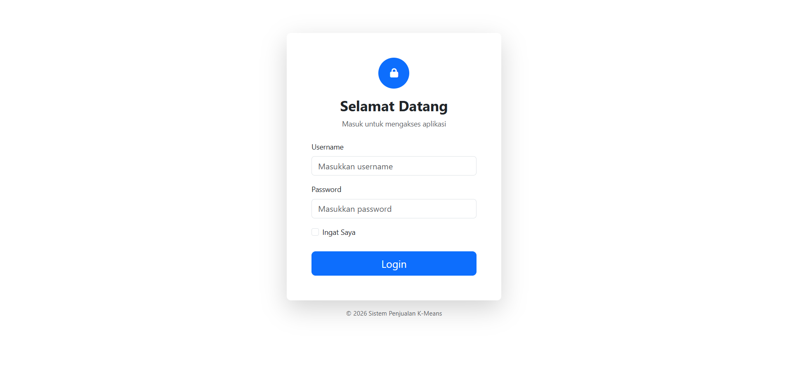
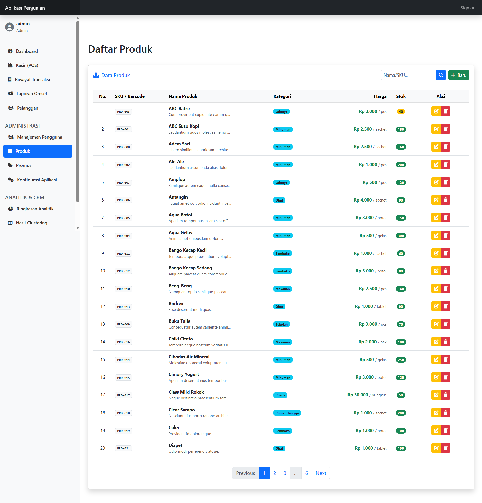
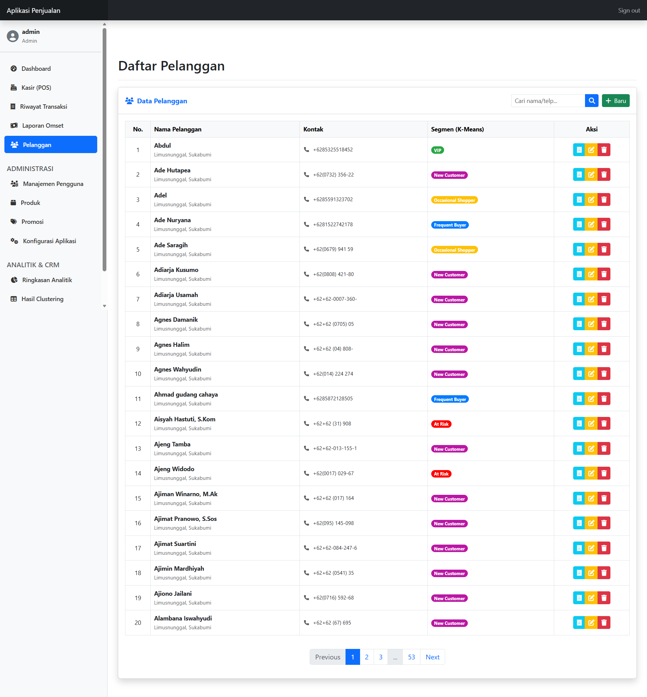
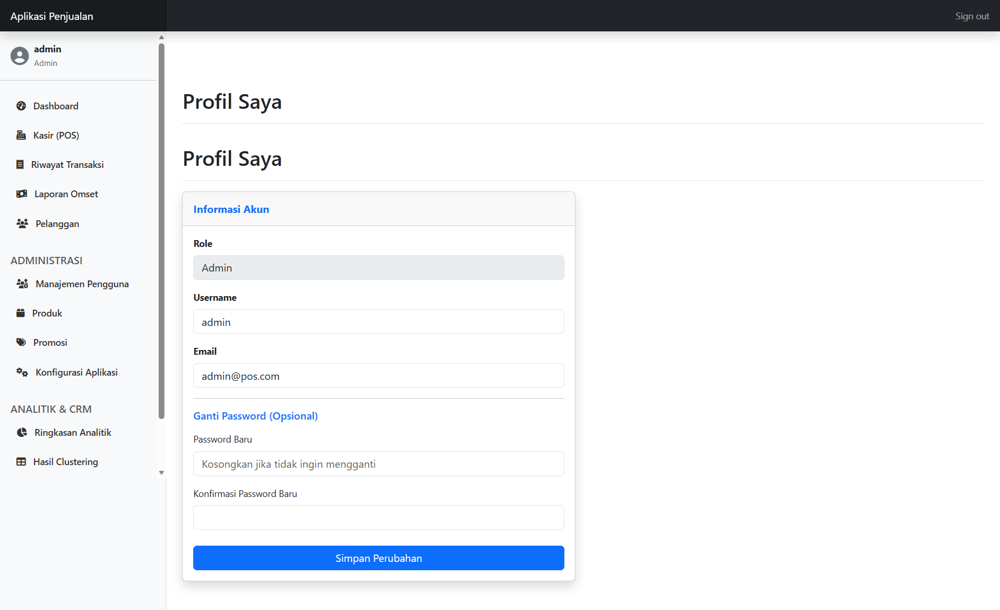

# BUKU PANDUAN PENGGUNAAN APLIKASI

---

<div align="center">

# 📊 SISTEM INFORMASI PENJUALAN

## Dengan Analisis Segmentasi Pelanggan

## Menggunakan Algoritma K-Means Clustering

---

### Versi 1.0

**Disusun Oleh:**  
**KEMAL FIQRI HANDOKO**  
NIM: 20210040045  
Program Studi Teknik Informatika  
Universitas Nusa Putra Sukabumi  
Angkatan 2021 - Semester 10

**Tahun 2026**

---

</div>

---

# DAFTAR ISI

1. [Pendahuluan](#1-pendahuluan)
2. [Spesifikasi Program](#2-spesifikasi-program)
3. [Instalasi dan Konfigurasi](#3-instalasi-dan-konfigurasi)
4. [Panduan Penggunaan](#4-panduan-penggunaan)
   - [4.1 Login Sistem](#41-login-sistem)
   - [4.2 Dashboard](#42-dashboard)
   - [4.3 Manajemen Produk](#43-manajemen-produk)
   - [4.4 Manajemen Pelanggan](#44-manajemen-pelanggan)
   - [4.5 Sistem Kasir (POS)](#45-sistem-kasir-pos)
   - [4.6 Riwayat Transaksi](#46-riwayat-transaksi)
   - [4.7 Analisis K-Means](#47-analisis-k-means)
   - [4.8 Manajemen Promosi](#48-manajemen-promosi)
   - [4.9 Manajemen Segmen](#49-manajemen-segmen)
   - [4.10 Manajemen Pengguna](#410-manajemen-pengguna)
   - [4.11 Pengaturan Aplikasi](#411-pengaturan-aplikasi)
5. [Hak Akses Pengguna](#5-hak-akses-pengguna)
6. [Troubleshooting](#6-troubleshooting)

---

# 1. PENDAHULUAN

## 1.1 Latar Belakang

Sistem Informasi Penjualan dengan Analisis Segmentasi Pelanggan K-Means adalah aplikasi berbasis web yang dirancang untuk membantu bisnis mengelola operasional penjualan sehari-hari sekaligus menganalisis perilaku pelanggan secara otomatis.

Aplikasi ini mengimplementasikan algoritma **K-Means Clustering** untuk mengelompokkan pelanggan berdasarkan analisis **RFM (Recency, Frequency, Monetary)**, sehingga bisnis dapat:

- Mengidentifikasi pelanggan bernilai tinggi (VIP)
- Merancang strategi promosi yang tepat sasaran
- Meningkatkan retensi pelanggan

## 1.2 Tujuan Aplikasi

1. Mempermudah pencatatan transaksi penjualan
2. Mengelola data produk dan pelanggan secara terpusat
3. Menganalisis perilaku pelanggan dengan algoritma K-Means
4. Memberikan rekomendasi promosi berdasarkan segmentasi pelanggan
5. Menyediakan dashboard untuk monitoring bisnis

## 1.3 Ruang Lingkup

Aplikasi ini mencakup modul-modul berikut:

- **Autentikasi**: Login dan manajemen pengguna
- **Master Data**: Produk dan Pelanggan
- **Transaksi**: Point of Sales (POS) dan Riwayat Transaksi
- **Analitik**: Segmentasi K-Means dengan RFM
- **Promosi**: Diskon berbasis segmen pelanggan
- **Pengaturan**: Konfigurasi nama dan tema aplikasi

---

# 2. SPESIFIKASI PROGRAM

## 2.1 Teknologi yang Digunakan

| Komponen              | Teknologi                            |
| --------------------- | ------------------------------------ |
| **Framework Backend** | Flask (Python 3.8+)                  |
| **Database**          | Mysql / PostgreSQL / SQLite          |
| **ORM**               | SQLAlchemy                           |
| **Migration**         | Flask-Migrate                        |
| **Authentication**    | Flask-Login                          |
| **Frontend**          | Bootstrap 5, jQuery                  |
| **Data Analysis**     | Pandas, Scikit-learn (K-Means)       |
| **Charts**            | Chart.js                             |
| **DataTables**        | jQuery DataTables (Export Excel/CSV) |

## 2.2 Struktur Modul Aplikasi

```
📁 Aplikasi Penjualan K-Means
├── 📂 blueprints/          # Modul-modul aplikasi
│   ├── analytics/          # Analisis K-Means
│   ├── auth/               # Autentikasi (Login/Logout)
│   ├── customers/          # Manajemen Pelanggan
│   ├── products/           # Manajemen Produk
│   ├── promotions/         # Manajemen Promosi
│   ├── sales/              # Kasir dan Transaksi
│   ├── segments/           # Manajemen Segmen
│   ├── settings/           # Pengaturan Aplikasi
│   └── users/              # Manajemen Pengguna
├── 📂 models/              # Model Database
├── 📂 templates/           # Tampilan HTML
├── 📂 static/              # File CSS, JS, Gambar
└── 📂 utils/               # Fungsi Utilitas
```

## 2.3 Fitur Utama

| No  | Fitur                   | Deskripsi                                                       |
| --- | ----------------------- | --------------------------------------------------------------- |
| 1   | **Dashboard**           | Ringkasan statistik bisnis (produk, pelanggan, transaksi, stok) |
| 2   | **Point of Sales**      | Sistem kasir dengan scan barcode dan pencarian produk           |
| 3   | **Manajemen Produk**    | CRUD produk dengan kategori dan SKU/Barcode                     |
| 4   | **Manajemen Pelanggan** | CRUD pelanggan dengan riwayat transaksi                         |
| 5   | **Analisis K-Means**    | Segmentasi pelanggan otomatis berdasarkan RFM                   |
| 6   | **Promosi Cerdas**      | Diskon otomatis berdasarkan segmen pelanggan                    |
| 7   | **Laporan Omset**       | Perbandingan penjualan sebelum dan sesudah sistem               |
| 8   | **Multi-Role**          | Hak akses berbeda untuk Admin dan Kasir                         |

## 2.4 Konsep RFM dalam K-Means

Sistem ini menggunakan **RFM Analysis** untuk mengelompokkan pelanggan:

| Metrik        | Deskripsi                            | Interpretasi                      |
| ------------- | ------------------------------------ | --------------------------------- |
| **Recency**   | Berapa hari sejak transaksi terakhir | Semakin kecil = semakin baik      |
| **Frequency** | Berapa kali pelanggan bertransaksi   | Semakin tinggi = semakin loyal    |
| **Monetary**  | Total nilai belanja pelanggan        | Semakin tinggi = semakin bernilai |

Hasil segmentasi default sistem akan menghasilkan kategori:

- 🏆 **VIP**: Pelanggan dengan nilai belanja tertinggi
- 🥇 **Frequent Buyer**: Pelanggan yang sering berbelanja
- 🥈 **Occasional Shopper**: Pelanggan yang jarang berbelanja
- ⚠️ **At Risk**: Pelanggan yang sudah lama tidak berbelanja
- 🆕 **New Customer**: Pelanggan baru terdaftar tanpa transaksi

---

# 3. INSTALASI DAN KONFIGURASI

## 3.1 Persyaratan Sistem

- Python 3.8 atau lebih tinggi
- pip (Python Package Manager)
- Mysql / PostgreSQL (untuk produksi) atau SQLite (untuk development)
- Browser modern (Chrome, Firefox, Edge)

## 3.2 Langkah Instalasi

### Langkah 1: Clone Repository

```bash
git clone https://github.com/Kemalti21a/web-penjualan-kmeans.git
cd web-penjualan-kmeans
```

### Langkah 2: Buat Virtual Environment

```bash
python -m venv venv
venv\Scripts\activate   # Windows
source venv/bin/activate  # Linux/Mac
```

### Langkah 3: Install Dependencies

```bash
pip install -r requirements.txt
```

### Langkah 4: Konfigurasi Environment

Buat file `.env` berdasarkan `.env.example`:

```env
SECRET_KEY=your_secret_key_here
DATABASE_URL=sqlite:///app.db
# FLASK_DEBUG=True (Opsional untuk mode pengembangan)
```

### Langkah 5: Inisialisasi Database

```bash
flask db upgrade
flask seed-db    # Opsional: Isi data dummy (Sangat disarankan untuk testing awal)
```

> **Catatan:** Perintah `flask seed-db` akan menghapus semua data lama dan mengisi dengan data contoh, termasuk ribuan transaksi simulasi untuk keperluan analisis K-Means.

### Langkah 6: Jalankan Aplikasi

```bash
flask run
# atau
python app.py
```

Aplikasi akan berjalan di: `http://localhost:5000`

## 3.3 Akun Default

Jika Anda menjalankan `flask seed-db`, gunakan akun berikut:

| Username  | Password   | Role    |
| --------- | ---------- | ------- |
| **admin** | `password` | Admin   |
| **kasir** | `password` | Cashier |

> ⚠️ **Penting**: Segera ganti password default melalui menu **Profil Saya** atau **Kelola Pengguna** setelah login pertama kali.

---

# 4. PANDUAN PENGGUNAAN

## 4.1 Login Sistem

### Halaman Login

1. Buka aplikasi melalui browser (`http://localhost:5000`)
2. Masukkan **Username** dan **Password**
3. Centang **Ingat Saya** jika ingin tetap login di perangkat yang sama
4. Klik tombol **Login**

<div align="center">
  
  <br>
  <em>Gambar 1: Halaman Login Aplikasi</em>
</div>

### Setelah Login

- **Admin**: Diarahkan ke Dashboard Utama dengan akses penuh.
- **Kasir**: Diarahkan ke Dashboard Penjualan dengan akses terbatas (POS & Riwayat Transaksi).

---

## 4.2 Dashboard

Dashboard menampilkan ringkasan informasi penting bisnis Anda.

<div align="center">
  
  <br>
  <em>Gambar 2: Tampilan Dashboard Admin</em>
</div>

### Kartu Statistik

| Kartu                     | Deskripsi                         |
| ------------------------- | --------------------------------- |
| 📦 **Total Produk**       | Jumlah produk terdaftar di sistem |
| 👥 **Total Pelanggan**    | Jumlah pelanggan terdaftar        |
| 🧾 **Transaksi Hari Ini** | Jumlah transaksi pada hari ini    |
| ⚠️ **Stok Menipis**       | Jumlah produk yang stoknya < 10   |

### Panel Transaksi Terbaru

Menampilkan 5 transaksi terakhir secara real-time.

### Panel Perlu Restock

Menampilkan daftar produk prioritas yang stoknya hampir habis.

### Aksi Cepat (Admin Only)

- 🛒 **Transaksi Baru (POS)**: Pintasan ke halaman kasir
- 👤 **Tambah Pelanggan**: Pintasan form pelanggan baru
- ➕ **Tambah Produk**: Pintasan form produk baru
- 🧠 **Jalankan AI Analitik**: Pintasan untuk memproses ulang segmen pelanggan

---

## 4.3 Manajemen Produk

### Melihat Daftar Produk

1. Klik menu **Produk** di sidebar
2. Daftar produk ditampilkan dengan fitur pencarian dan pagination
3. Anda dapat mengurutkan berdasarkan nama, kategori, harga, atau stok

<div align="center">
  
  <br>
  <em>Gambar 3: Halaman Manajemen Produk</em>
</div>

### Menambah Produk Baru (Admin Only)

1. Klik tombol **+ Tambah Produk**
2. Isi formulir:
   - **SKU/Barcode**: Kode unik (wajib)
   - **Nama Produk**: Nama lengkap produk
   - **Harga**: Harga jual (Rupiah)
   - **Stok**: Stok awal
   - **Kategori**: Pilih atau buat kategori baru
3. Klik **Simpan**

### Edit & Hapus (Admin Only)

- Klik ikon **Edit** (pensil) untuk mengubah data.
- Klik ikon **Hapus** (tempat sampah) untuk menghapus.
- _Catatan:_ Produk yang sudah pernah terjual tidak dapat dihapus permanen demi integritas data laporan. Sistem akan menyarankan untuk menonaktifkan stok (set ke 0).

---

## 4.4 Manajemen Pelanggan

### Melihat Daftar Pelanggan

1. Klik menu **Pelanggan** di sidebar
2. Cari pelanggan berdasarkan nama atau nomor telepon

<div align="center">
  
  <br>
  <em>Gambar 4: Halaman Data Pelanggan</em>
</div>

### Menambah Pelanggan Baru

1. Klik tombol **+ Tambah Pelanggan**
2. Data wajib: **Nama Lengkap** dan **No. Telepon**
3. Data opsional: Email dan Alamat

### Riwayat Pelanggan

1. Klik ikon **Riwayat** pada baris pelanggan
2. Sistem menampilkan sejarah belanja lengkap pelanggan tersebut, total pengeluaran, dan prediksi segmen saat ini.

---

## 4.5 Sistem Kasir (POS)

Halaman utama untuk operasional kasir.

<div align="center">
  
  <br>
  <em>Gambar 5: Halaman Point of Sales (POS)</em>
</div>

### Langkah Transaksi

1. **Cari/Scan Produk**
   - Gunakan Scanner Barcode (otomatis masuk keranjang jika hasil tunggal)
   - Atau ketik nama produk manual

2. **Pilih Pelanggan (PENTING untuk Promo)**
   - Klik tombol **🔍 Cari** di panel kanan
   - Pilih pelanggan member
   - Sistem akan otomatis menampilkan **Badge Segmen** (misal: VIP) dan **Info Promo** yang tersedia.

3. **Terapkan Promosi**
   - Jika tersedia promo, panel kanan akan menampilkan tombol **Gunakan Promo**.
   - Klik tombol tersebut untuk melihat estimasi potongan harga.
   - _Catatan:_ Sistem backend akan melakukan validasi ulang saat pembayaran untuk memastikan pelanggan mendapatkan diskon terbaik yang berhak mereka terima.

4. **Pembayaran**
   - Pilih metode: Tunai, Kartu, QRIS, atau Transfer.
   - Masukkan catatan jika perlu.
   - Klik **PROSES PEMBAYARAN**.

5. **Selesai**
   - Modal sukses muncul dengan detail kembalian dan ID transaksi.
   - Klik **Transaksi Baru** untuk mereset kasir.

---

## 4.6 Riwayat Transaksi & Laporan

### Riwayat Transaksi

Menu **Penjualan → Transaksi** menampilkan log penjualan lengkap. Anda dapat memfilter berdasarkan tanggal (Start Date - End Date).

<div align="center">
  
  <br>
  <em>Gambar 6: Riwayat Transaksi</em>
</div>

### Laporan Omset

Menu **Penjualan → Laporan Omset** menampilkan grafik pendapatan harian.

- **Penting**: Grafik ini membandingkan jumlah transaksi, jumlah pelanggan unik, dan total omset.

<div align="center">
  
  <br>
  <em>Gambar 7: Grafik Laporan Omset</em>
</div>

### Komparasi Sebelum/Sesudah Sistem

Menu **Analitik → Komparasi** (Admin Only).

- Menampilkan perbandingan omset sebelum dan sesudah implementasi sistem diskon (Hardcoded cutoff: 1 Mei 2025).

<div align="center">
  
  <br>
  <em>Gambar 8: Perbandingan Omset Sebelum & Sesudah Sistem Diskon</em>
</div>

---

## 4.7 Analisis K-Means

Fitur inti untuk segmentasi pelanggan otomatis.

### Cara Menjalankan (Admin Only)

1. Masuk menu **Analitik → Dashboard**
2. Klik **Jalankan AI Analitik**
3. Tentukan jumlah cluster (Default: 3).

<div align="center">
  
  <br>
  <em>Gambar 9: Dashboard Analitik & Sebaran Pelanggan</em>
</div>

### Hasil Analisis

Setelah proses selesai, pelanggan akan otomatis dikelompokkan dan dilabeli ulang:

- **RFM Analysis**: Sistem menghitung Recency, Frequency, dan Monetary terbaru.
- **Clustering**: K-Means membagi pelanggan ke dalam kelompok yang mirip.
- **Auto-Labeling**: Sistem memberi nama segmen berdasarkan nilai belanja (Monetary), misal cluster dengan belanja tertinggi otomatis menjadi "VIP".

<div align="center">
  
  <br>
  <em>Gambar 10: Tabel Hasil Clustering K-Means</em>
</div>

### Zona Berbahaya (Reset Data)

Di halaman dashboard analitik terdapat tombol **Reset Semua Data**.

> ⚠️ **PERINGATAN**: Tombol ini menghapus **SELURUH** database transaksi, pelanggan, dan produk. Hanya gunakan saat tahap testing/development.

---

## 4.8 Manajemen Promosi

Membuat aturan diskon otomatis.

<div align="center">
  
  <br>
  <em>Gambar 11: Daftar Promosi Aktif</em>
</div>

### Menambah Promosi (Admin Only)

1. Menu **Promosi → Tambah Promosi**
2. Pilih **Segmen Target** (Misal: VIP)
3. Pilih Tipe:
   - **Persentase**: Potongan % (misal 10%)
   - **Nominal**: Potongan Rupiah (misal Rp 10.000)
4. Masukkan Nilai dan Deskripsi.

**Aturan Main:**

- Satu segmen hanya bisa memiliki satu promosi aktif pada satu waktu.
- Promosi hanya berlaku jika kasir memilih pelanggan yang terdaftar dalam segmen tersebut saat transaksi.

---

## 4.9 Manajemen Segmen

Menu **Segmen** memungkinkan Admin untuk:

- Mengubah nama tampilan segmen (misal mengubah "Frequent Buyer" menjadi "Pelanggan Setia").
- Mengubah warna badge untuk tampilan UI.
- Melihat daftar anggota per segmen.

<div align="center">
  
  <br>
  <em>Gambar 12: Pengaturan Nama dan Warna Segmen</em>
</div>

---

## 4.10 Manajemen Pengguna

### Profil Saya

Mengubah password dan informasi akun sendiri.

<div align="center">
  
  <br>
  <em>Gambar 13: Halaman Profil Pengguna</em>
</div>

### Kelola Pengguna (Admin Only)

- Menambah akun kasir baru.
- Mereset password kasir jika lupa.
- Menonaktifkan akun.

<div align="center">
  
  <br>
  <em>Gambar 14: Daftar Pengguna Sistem</em>
</div>

---

## 4.11 Pengaturan Aplikasi

Menu **Pengaturan** (Admin Only):

- Mengubah **Nama Aplikasi** (Judul di Header).
- Mengubah **Warna Tema** (Warna tombol dan aksen aplikasi).

<div align="center">
  
  <br>
  <em>Gambar 15: Konfigurasi Tampilan Aplikasi</em>
</div>

---

# 5. HAK AKSES PENGGUNA

| Fitur                   | Admin |     Kasir     |
| ----------------------- | :---: | :-----------: |
| Akses Dashboard Utama   |  ✅   | ✅ (Terbatas) |
| Transaksi (POS)         |  ✅   |      ✅       |
| Kelola Produk (CRUD)    |  ✅   |  ❌ (Lihat)   |
| Kelola Pelanggan        |  ✅   |      ✅       |
| Hapus Pelanggan         |  ✅   |      ❌       |
| Jalankan K-Means        |  ✅   |      ❌       |
| Lihat Hasil Analitik    |  ✅   |  ❌ (Lihat)   |
| Kelola Promosi & Segmen |  ✅   |      ❌       |
| Kelola Pengguna         |  ✅   |      ❌       |
| Reset Data Sistem       |  ✅   |      ❌       |

---

# 6. TROUBLESHOOTING

### 1. Login Gagal

- Pastikan menggunakan user default yang benar: `admin` / `password` atau `kasir` / `password`.
- Password case-sensitive.

### 2. Diskon Tidak Muncul

- Pastikan pelanggan sudah dipilih di POS.
- Pastikan pelanggan tersebut masuk dalam segmen yang memiliki promosi aktif.
- Cek menu **Analitik → Segmen** untuk memastikan pelanggan tersebut masuk ke segmen yang diharapkan.
- Jika pelanggan baru, mereka mungkin masuk ke segmen "New Customer" yang belum diset promosinya.

### 3. Error saat Checkout "Stok Kurang"

- Cek stok aktual produk di menu Produk.
- Jika stok ada tapi error muncul, coba refresh halaman POS untuk sinkronisasi ulang data stok terbaru.

### 4. Hasil K-Means "Tidak Cukup Data"

- Algoritma membutuhkan minimal sejumlah data transaksi yang variatif.
- Gunakan `flask seed-db` untuk mengisi data dummy jika sedang dalam tahap percobaan.

### 5. Tanggal Transaksi Kosong di Grafik

- Grafik hanya menampilkan tanggal yang memiliki transaksi. Tanggal tanpa transaksi tidak di-plot untuk efisiensi visual.

---

<div align="center">

**© 2026 Sistem Informasi Penjualan dengan K-Means Clustering**

</div>
